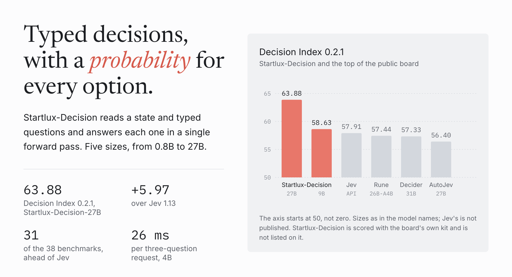
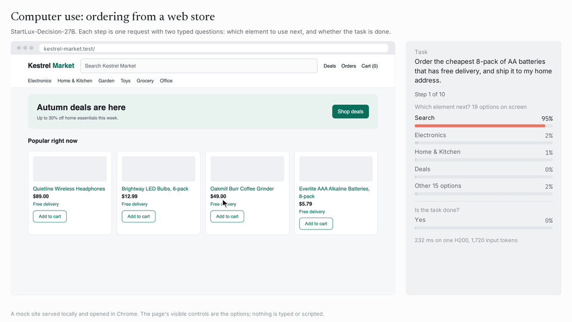
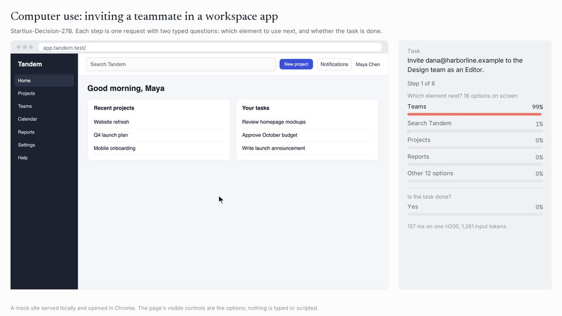
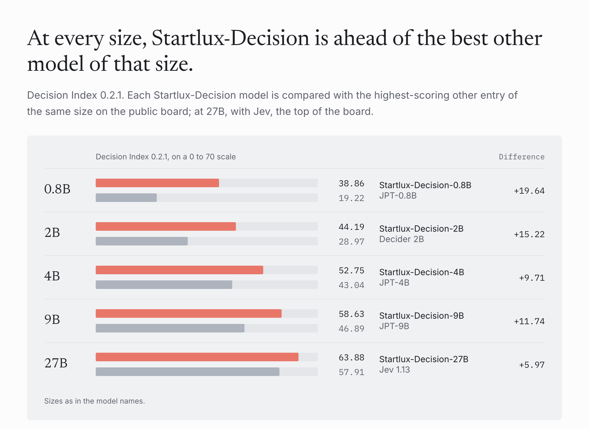
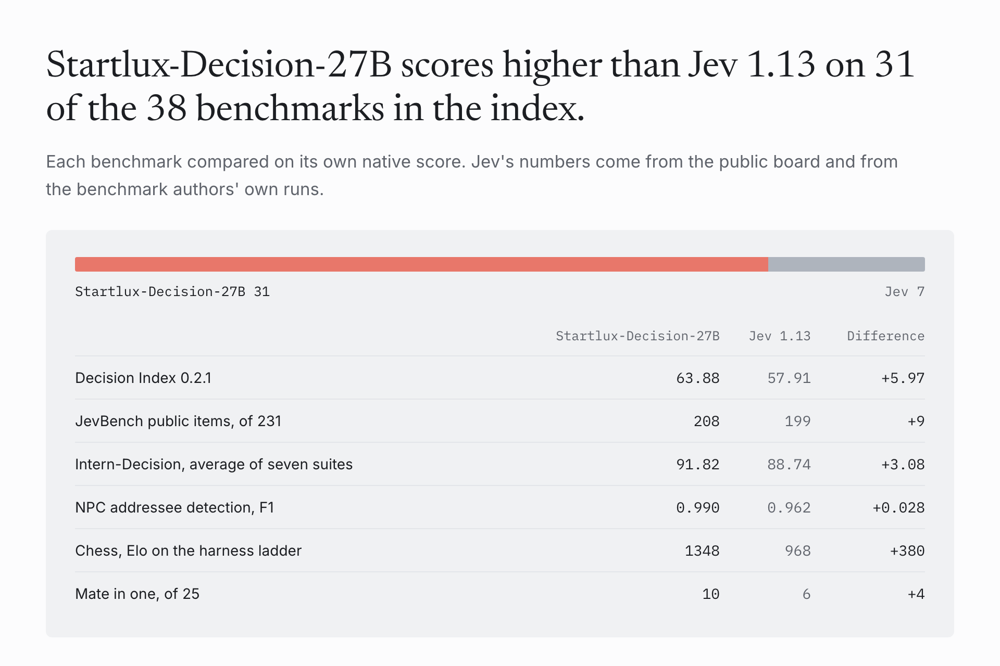
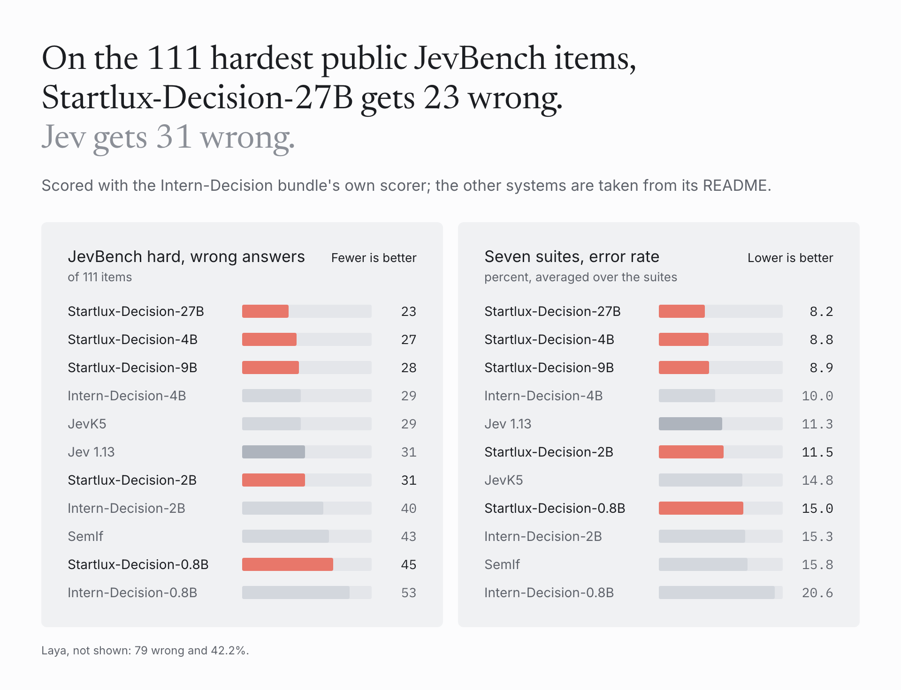
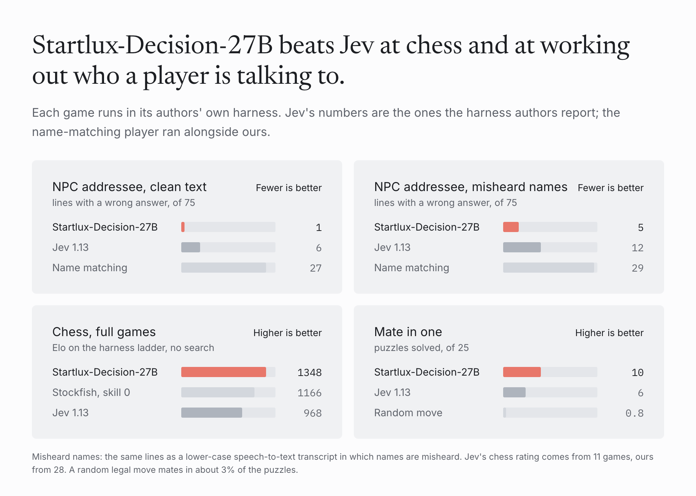

<p align="center"></p>

<p align="center">
  <a href="https://huggingface.co/collections/startlux-models/startlux-decision-6abba92b301b573fa154d493">Models on Hugging Face</a> ·
  <a href="docs/results.md">Results</a> ·
  <a href="docs/inference.md">Inference</a> ·
  <a href="docs/evaluation.md">Evaluation</a> ·
  <a href="docs/finetuning.md">Fine-tuning</a> ·
  <a href="results/">Raw results</a>
</p>

Startlux-Decision is a family of typed decision models in five sizes, from 0.8B to 27B. You send a state and a set of
questions: pick one of several options, yes or no, or a rating on a scale. Every question comes back with a probability
for each option. Nothing is generated; the answer is read from the option letters after one forward pass, so a short
question takes a few milliseconds and the probabilities can be used as confidence. Requests and responses use the
TypeSafe `/v1/systemone` format, so clients written for Jev work unchanged. This repository has the inference code,
the evaluation scripts, the results and the raw game logs. The weights are on Hugging Face, in the
[Startlux-Decision collection](https://huggingface.co/collections/startlux-models/startlux-decision-6abba92b301b573fa154d493).

## Demos

<table>
  <tr>
    <td width="50%" align="center"><a href="media/computer_use_store_27b.mp4"></a><br><sub>Startlux-Decision-27B finds the cheapest AA 8-pack with free delivery and orders it to the right address</sub></td>
    <td width="50%" align="center"><a href="media/computer_use_workspace_27b.mp4"></a><br><sub>Startlux-Decision-27B invites a teammate to a team as an Editor</sub></td>
  </tr>
  <!-- two more demos go here
  <tr>
    <td width="50%" align="center"><a href="media/DEMO3.mp4"></a><br><sub>caption</sub></td>
    <td width="50%" align="center"><a href="media/DEMO4.mp4"></a><br><sub>caption</sub></td>
  </tr>
  -->
</table>

Both are real runs of Startlux-Decision-27B; click a preview for the video. A real Chrome window opens a small mock site, and
every step is one request with two typed questions: which of the controls visible on the page to use next, and whether
the task is done. The harness carries out the chosen action and nothing else. The model never types text; a text box
it clicks only opens its suggestion list. Both tasks were completed, and the harness checked the result against the
task. The side panel lists the four likeliest controls and the rest in one row, so that block adds up to 100%; below
it, set apart, is the probability that the task is done. The harness and the two sites are in
[demos/computer_use](demos/computer_use).

## Decision Index

<p align="center"></p>

Startlux-Decision-27B reaches 63.88 on Decision Index 0.2.1 and Startlux-Decision-9B 58.63, scored with the board's own kit on the full
suite. The highest entry on the public board (2026-09-28) is Jev 1.13 at 57.91; our runs are not on the board.
Startlux-Decision-27B scores higher than Jev on 31 of the 38 benchmarks in the index. Our training data includes the public
train splits of 14 of them, marked † below; their test items were filtered out of it.

Every cell below is on the index's own scale: the benchmark's metric, corrected for chance, so 0% is random guessing
and 100% is perfect. The index is a weighted mean of these cells, which is why the first row matches the chart.

| | Startlux-Decision-27B | Startlux-Decision-9B | Startlux-Decision-4B | Jev 1.13 | Rune 26B-A4B | Decider chat 31B | AutoJev-27B |
|---|---:|---:|---:|---:|---:|---:|---:|
| **Decision Index 0.2.1** | **63.88** | 58.63 | 52.75 | 57.91 | 57.44 | 57.33 | 56.40 |
| *Knowledge & Reasoning* | *44.3* | *38.0* | *32.1* | ***51.4*** | *43.4* | *44.3* | *40.9* |
| GSM8K † | **95.3** | 94.3 | 87.8 | 75.6 | 75.7 | 78.8 | 61.1 |
| ChessBench | 10.7 | 5.3 | 4.0 | 9.8 | 11.5 | **15.4** | 9.8 |
| MuSR | **48.8** | 34.9 | 30.0 | 46.1 | 44.2 | 43.1 | 39.3 |
| SATA-Bench | 9.3 | 25.3 | 14.0 | 25.4 | **34.0** | 28.4 | 28.9 |
| GPQA Diamond ★ | 34.0 | 33.3 | 22.4 | **71.4** | 29.2 | 32.0 | 32.6 |
| CRUXEval | 61.6 | 36.5 | 27.6 | 57.1 | 59.4 | **67.2** | 60.2 |
| CLadder | 47.3 | 36.1 | 31.8 | 45.3 | 45.5 | **49.2** | 49.0 |
| HLE ★ | 0.0 | 0.0 | 0.0 | **4.7** | 0.0 | 0.0 | 0.0 |
| MMLU-Pro ★ | 66.0 | 56.5 | 51.6 | **80.5** | 63.1 | 65.8 | 60.1 |
| BBH ★ | 71.3 | 58.2 | 52.0 | **89.7** | 72.7 | 65.5 | 68.3 |
| *Language Understanding* | ***74.5*** | *71.3* | *63.9* | *62.0* | *63.1* | *60.4* | *63.5* |
| ContractNLI † | 80.3 | **80.6** | 76.8 | 59.1 | 66.7 | 61.8 | 68.4 |
| ANLI ★ † | **67.0** | 64.6 | 54.9 | 62.2 | 60.3 | 59.8 | 56.0 |
| WinoGrande ★ | **87.1** | 83.0 | 70.3 | 83.9 | 71.9 | 67.3 | 70.3 |
| HellaSwag ★ | **96.8** | 95.7 | 92.4 | 92.7 | 89.9 | 89.4 | 92.0 |
| ACOS † | **50.4** | 46.2 | 32.2 | 27.3 | 24.4 | 16.2 | 17.8 |
| FinEntity | 89.3 | 82.6 | 86.6 | 80.8 | 83.0 | 86.6 | **89.6** |
| iSarcasmEval † | **52.4** | 51.9 | 37.3 | 36.3 | 49.0 | 37.0 | 49.0 |
| VAST † | **73.4** | 68.7 | 65.0 | 46.9 | 64.9 | 59.8 | 56.2 |
| NLI4CT † | **72.3** | 66.1 | 60.0 | 69.0 | 62.0 | 66.6 | 70.5 |
| RAGTruth † | **70.1** | 67.5 | 58.5 | 51.3 | 51.9 | 52.2 | 59.2 |
| *Retrieval & Classification* | ***66.8*** | *64.1* | *56.7* | *55.4* | *63.5* | *63.1* | *54.9* |
| BANKING77 ★ † | 90.9 | **91.3** | 85.7 | 79.5 | 83.5 | 78.8 | 78.8 |
| CLINC150 ★ † | 92.9 | **93.1** | 91.5 | 89.2 | 87.3 | 91.1 | 87.7 |
| BRIGHT ★ | **43.5** | 41.3 | 38.2 | 40.6 | 39.3 | 36.2 | 41.9 |
| Amazon ESCI † | **47.9** | 47.4 | 43.2 | 43.8 | 43.9 | 41.2 | 43.7 |
| PhishNChips | 40.9 | 28.5 | 19.8 | 25.1 | 61.8 | **75.0** | 19.9 |
| HoVer † | **79.2** | 76.5 | 52.8 | 45.7 | 61.3 | 52.8 | 48.4 |
| *Tools & Automation* | ***82.2*** | *73.2* | *72.3* | *75.1* | *71.2* | *75.6* | *79.3* |
| BFCL ★ | 96.7 | 97.0 | 94.7 | 94.3 | 93.0 | **97.3** | 96.8 |
| ToolRet | **64.3** | 61.5 | 62.5 | 59.9 | 58.9 | 58.0 | 62.4 |
| API-Bank ★ | 83.8 | 77.9 | 86.0 | **88.0** | 83.0 | 84.8 | 83.8 |
| Home appliances | **77.3** | 38.6 | 30.7 | 52.3 | 46.6 | 62.5 | 73.9 |
| When2Call | **85.7** | 85.2 | 80.3 | 74.6 | 68.0 | 69.2 | 75.6 |
| *Arts & Human Taste* | ***47.9*** | *41.8* | *33.7* | *37.7* | *41.9* | *38.3* | *39.4* |
| BPoMP | **90.6** | 82.1 | 66.3 | 81.8 | 79.9 | 81.2 | 87.8 |
| Humicroedit † | 25.8 | 24.3 | 19.6 | 23.7 | 24.4 | **27.6** | 24.8 |
| POP909 | 50.6 | 25.5 | 16.0 | 15.9 | **65.8** | 27.3 | 37.3 |
| cfcolor | **43.6** | 42.4 | 30.5 | 28.8 | 25.1 | 25.2 | 28.8 |
| ForecastBench ★ | **34.3** | 26.6 | 24.6 | 30.6 | 18.9 | 19.2 | 22.1 |
| Habermas | 18.4 | 22.5 | 17.7 | 21.5 | 16.2 | **24.4** | 15.5 |
| New Yorker † | **74.2** | 72.1 | 63.3 | 62.6 | 67.6 | 67.3 | 62.8 |

★ benchmarks weigh 1.2 in the index. The italic rows are the index's own area scores. Bold marks the best score in
each row. The other systems' values come from the
public board. The metric of each benchmark and the raw scores of all five sizes are in [docs/results.md](docs/results.md)
and [results/decision_index_benchmarks.csv](results/decision_index_benchmarks.csv).

## At every size

<p align="center"></p>

The public JevBench items are the comparison most decision models of this kind report. The table lists the systems
in the Intern-Decision bundle next to ours; a blank cell means the number is not published.

| Model | JevBench public, of 231 | Intern avg | DI 0.2 / 0.2.1 | Latency, 3 questions |
|---|---:|---:|---:|---:|
| Startlux-Decision-27B | **208** | **91.82** | **59.54 / 63.88** | 102.3 ms |
| Startlux-Decision-9B | 201 | 91.08 | 54.37 / 58.63 | 35.7 ms |
| Startlux-Decision-4B | 204 | 91.17 | 48.38 / 52.75 | 26.0 ms |
| Intern-Decision-4B | 201 | 90.02 | 35.90 / 37.81 | 44.2 ms ¹ |
| JevK5 | 200 | 85.16 | 36.44 / 38.81 | |
| Jev 1.13 | 199 | 88.74 | 51.67 / 57.91 | 64.0 ms ² |
| Startlux-Decision-2B | 196 | 88.46 | 40.72 / 44.19 | 15.5 ms |
| SemIf | 187 | 84.23 | 25.70 / 25.94 | |
| Intern-Decision-2B | 180 | 84.68 | 19.49 / 19.38 | 33.3 ms ¹ |
| Startlux-Decision-0.8B | 179 | 85.03 | 35.57 / 38.86 | **12.2 ms** |
| Intern-Decision-0.8B | 163 | 79.38 | 11.32 / 11.94 | 34.0 ms ¹ |
| Laya | 130 | 57.77 | 5.51 / 6.04 | |

JevBench public counts the correct answers on the 231 public items in the Intern-Decision bundle, Intern avg is the
average accuracy over its seven suites, and DI is the Decision Index under both editions (the public board's values for
the other systems). Our latencies are for one H200, with the three questions answered in one forward pass, as
Intern-Decision does. ¹ Intern-Decision's own measurement on an RTX 4090. ² The server time the TypeSafe API gateway
reports for the same request, mean of 100, so the network is left out as in ours; Intern-Decision reports 109.7 ms end
to end.

## Compared with Jev 1.13

<p align="center"></p>

## Accuracy suites

<p align="center"></p>

The Intern-Decision bundle has seven suites: the three public JevBench tiers, Typed Decisions, ToolACE, AG News and
WildJailBreak. Its ToolACE items are drawn from the public ToolACE training set, which has no held-out split, so
[docs/results.md](docs/results.md) also gives the average without it (Startlux-Decision-4B: 90.67, Intern-Decision-4B: 88.95).
JevBench public counts the correct answers on the 231 public items in the bundle. It is not the official JevBench
score, which adds a sealed tier, speed and cost and is measured only by the maintainers.

## Speed

<p align="center"></p>

The fast linear-attention kernels (`flash-linear-attention`, `causal-conv1d`) are required; the server refuses to
start on a GPU without them. All questions of a request run in one forward pass, and CUDA graphs remove most of the
launch overhead for short requests: Startlux-Decision-4B takes 90.3 ms for the same request without them. Bulk evaluation goes through a batched path instead. Details in
[docs/inference.md](docs/inference.md).

## Games

<p align="center"></p>

| Game | Measure | Startlux-Decision-27B | Jev 1.13 | Other reference |
|---|---|---:|---:|---|
| NPC addressee detection, clean text | lines with a wrong answer, of 75 (fewer is better) | 1 | 6 | name matching: 27 |
| NPC addressee detection, misheard names | lines with a wrong answer, of 75 (fewer is better) | 5 | 12 | name matching: 29 |
| NPC addressee detection, clean text | F1 over the yes/no answers | 0.990 | 0.962 | name matching: 0.820 |
| Chess, full games | Elo on the harness ladder, no search | 1348 | 968 | Stockfish skill 0: 1166 |
| Mate in one | puzzles solved, of 25 | 10 | 6 | a random legal move: 3% |
| Dino Run | runs that reach the 300-obstacle cap, of 20 | 20 | 20 | Startlux-Decision-4B and 9B: 20 |

Jev's numbers are the ones its harness authors report, except Dino Run, which we ran for Jev through its API in the
same harness as ours. Jev's chess rating comes from 11 games, ours from 28. The misheard-names variant is the same set
of lines as a lower-case speech-to-text transcript in which names are misheard.
The 0.8B and 2B models do much worse on these games. Every game, position and line is in
[results/games](results/games): Elo ladder games with PGN, chess positions and mate-in-one answers, and NPC predictions
per line in all three transcript variants.

## Quick start

The weights are on Hugging Face. Each model folder also carries the inference package from this repository.

| Model | Download | Size |
|---|---|---:|
| Startlux-Decision-0.8B | [startlux-models/Startlux-Decision-0.8B](https://huggingface.co/startlux-models/Startlux-Decision-0.8B) | 1.8 GB |
| Startlux-Decision-2B | [startlux-models/Startlux-Decision-2B](https://huggingface.co/startlux-models/Startlux-Decision-2B) | 4.6 GB |
| Startlux-Decision-4B | [startlux-models/Startlux-Decision-4B](https://huggingface.co/startlux-models/Startlux-Decision-4B) | 9.3 GB |
| Startlux-Decision-9B | [startlux-models/Startlux-Decision-9B](https://huggingface.co/startlux-models/Startlux-Decision-9B) | 19.4 GB |
| Startlux-Decision-27B | [startlux-models/Startlux-Decision-27B](https://huggingface.co/startlux-models/Startlux-Decision-27B) | 55.6 GB |

```bash
hf download startlux-models/Startlux-Decision-4B --local-dir Startlux-Decision-4B
pip install -r requirements.txt
python -m startlux_decision.check Startlux-Decision-4B          # must print "fast kernels: active"
python -m startlux_decision.server --model Startlux-Decision-4B --port 8090
```

```bash
curl -s localhost:8090/v1/systemone -H 'Content-Type: application/json' -d '{
  "state": {"ticket": "I was charged twice for order #4411 and the app still shows it as unpaid."},
  "questions": {
    "team":   {"type": "choice", "instructions": "Which team should handle this ticket?",
               "criteria": {"billing": "Payments, refunds and invoices",
                            "shipping": "Delivery and tracking",
                            "technical": "App, login and account problems"}},
    "urgent": {"type": "noul", "instructions": "Should this ticket be answered today?"},
    "severity": {"type": "score", "instructions": "How severe is the impact?",
                 "criteria": ["cosmetic", "annoying", "blocks the customer"]}
  }
}'
```

Or in Python:

```python
from startlux_decision import StartluxDecision

m = StartluxDecision("Startlux-Decision-4B")
answers, usage = m.decide(state, questions)          # one request
many = m.decide_batch([(state, questions), ...])     # many requests, batched together
```

[docs/inference.md](docs/inference.md) covers the request format, the speed-ups and FP8.
[docs/evaluation.md](docs/evaluation.md) explains how to reproduce every number above, including the batched Decision
Index runner. [docs/finetuning.md](docs/finetuning.md) shows how to adapt a model to your own decisions.

## Layout

```
startlux_decision/       inference: prompt rendering, letter readout, CUDA graphs, HTTP server, kernel check
demos/          the computer-use harness and its two mock sites
eval/           evaluation: Intern-Decision suites and JevBench public tiers, Typed Decisions, Decision Index, latency
finetune/       LoRA fine-tuning on your own data and temperature calibration
docs/           inference, evaluation, fine-tuning and full results
results/        our numbers as JSON and CSV, per-benchmark Decision Index scores, raw game and computer-use logs
media/          figures and recordings used here
```

## License

The code in this repository and the weights on Hugging Face are Apache-2.0. Benchmark data
is fetched from its original sources under their own terms.
