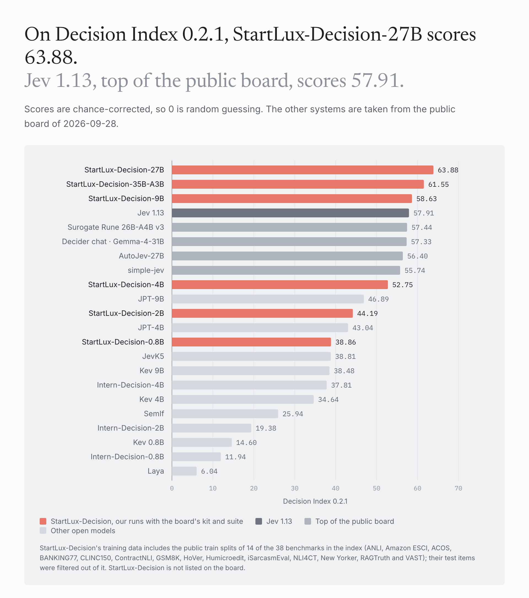
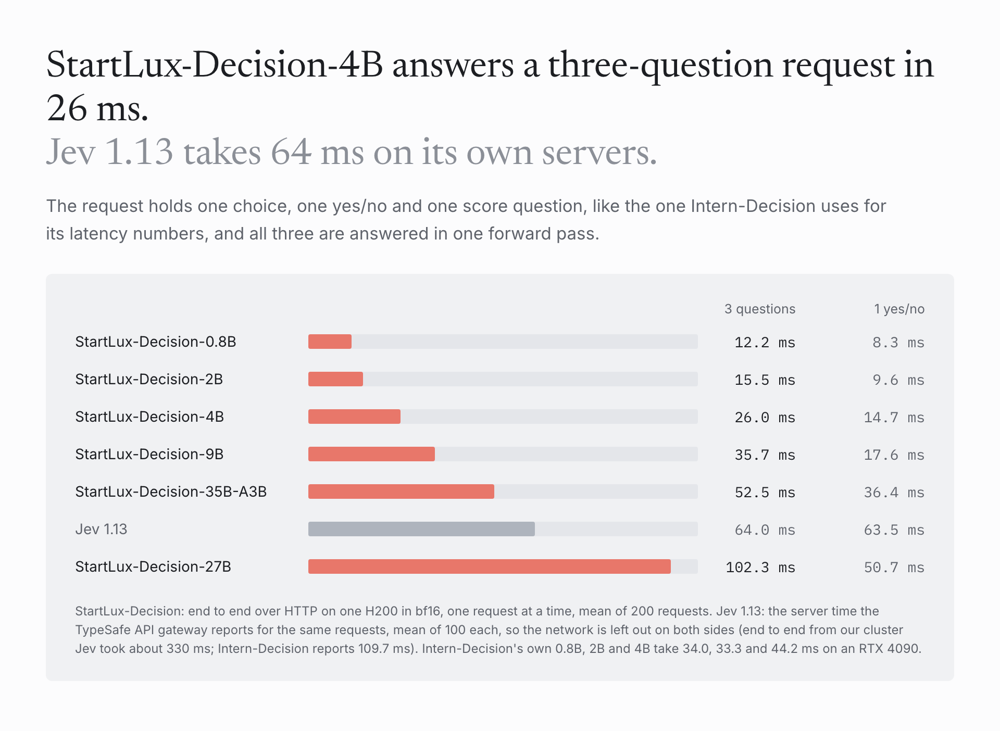

# Results

All numbers are for the six released models in bf16 with the per-type temperatures in their `decision_config.json`,
measured on H200 GPUs between 2026-09-27 and 2026-10-01. Numbers for other systems come from the sources named under
each table; we did not rerun them unless we say so. A machine-readable copy of our numbers is in
[results/summary.json](../results/summary.json) and [results/summary.csv](../results/summary.csv).

The ToolACE items in the Intern-Decision bundle are drawn from the public ToolACE training set, which has no held-out
test split, so next to the usual seven-suite average we also give the average without ToolACE.

The tables were produced with our internal evaluation code. To check that the code in this repository gives the same
answers, we reran StartLux-Decision-4B end to end with it (same weights and temperatures): JevBench public 204 of 231 (same),
Intern-Decision average 91.15 against 91.17 (two AG News and two WildJailBreak items out of 9,810 changed, which is bf16
rounding between batch shapes), Typed Decisions accuracy 0.799 (same), pilot Brier 0.499 (same), Decision Index 48.42 /
52.75 against 48.38 / 52.75. The latency numbers come from this repository's own server.

The five models as published on Hugging Face were checked the same way, each folder run through all seven
Intern-Decision suites with this repository's code. They answer 178, 194, 204, 201 and 209 of the 231 public JevBench
items (0.8B to 27B) against 179, 196, 204, 201 and 208 in the tables below: a few borderline items flip between the
two inference paths, in both directions. StartLux-Decision-35B-A3B, checked the same way, answers 208 against 210, with
an Intern-Decision average of 92.00 against 92.29.

## Intern-Decision suites and JevBench public tiers

Accuracy in percent. Easy, Original and Hard are the 48, 72 and 111 public JevBench items. Scored with
`eval/suites.py`; the other rows are from the Intern-Decision README (commit 2f81580), which uses the same scorer.

| Model | Easy | Original | Hard | Typed | ToolACE | AG News | WildJB | Average | Average without ToolACE |
|:---:|:---:|:---:|:---:|:---:|:---:|:---:|:---:|:---:|:---:|
| StartLux-Decision-0.8B | 100.00 | 90.28 | 59.46 | 75.85 | 91.94 | 90.97 | 86.70 | **85.03** | 83.88 |
| StartLux-Decision-2B | 100.00 | 94.44 | 72.07 | 77.95 | 93.23 | 89.43 | 92.13 | **88.46** | 87.67 |
| StartLux-Decision-4B | 100.00 | 100.00 | 75.68 | 79.95 | 94.19 | 90.91 | 97.47 | **91.17** | 90.67 |
| StartLux-Decision-9B | 100.00 | 97.22 | 74.77 | 81.45 | 94.84 | 91.97 | 97.33 | **91.08** | 90.46 |
| StartLux-Decision-27B | 100.00 | 100.00 | 79.28 | 80.20 | 94.52 | 90.57 | 98.19 | **91.82** | 91.37 |
| StartLux-Decision-35B-A3B | 100.00 | 98.61 | 81.98 | 81.30 | 95.48 | 91.00 | 97.65 | **92.29** | 91.76 |
| Jev 1.13 | 100.00 | 98.61 | 72.07 | 73.35 | 91.29 | 89.57 | 96.29 | 88.74 | 88.31 |
| Laya | 95.83 | 72.22 | 28.83 | 35.95 | 63.87 | 92.84 | 14.84 | 57.77 | 56.75 |
| SemIf | 100.00 | 98.61 | 61.26 | 62.80 | 85.16 | 89.22 | 92.53 | 84.23 | 84.07 |
| Kev (size not stated) | 100.00 | 93.06 | 45.05 | 65.60 | 87.42 | 89.82 | 75.97 | 79.56 | 78.25 |
| JevK5 | 100.00 | 97.22 | 73.87 | 64.50 | 80.97 | 89.13 | 90.45 | 85.16 | 85.86 |
| Intern-Decision-0.8B | 97.92 | 80.56 | 52.25 | 77.35 | 94.52 | 88.61 | 64.48 | 79.38 | 76.86 |
| Intern-Decision-2B | 100.00 | 84.72 | 63.96 | 79.35 | 96.45 | 89.96 | 78.33 | 84.68 | 82.72 |
| Intern-Decision-4B | 100.00 | 98.61 | 73.87 | 80.55 | 96.45 | 90.82 | 89.86 | 90.02 | 88.95 |

Counted in items (231 public JevBench items; other systems converted from the table above):

| System | Correct of 231 | Easy (48) | Original (72) | Hard (111) |
|:---:|:---:|:---:|:---:|:---:|
| StartLux-Decision-35B-A3B | **210** | 48 | 71 | **91** |
| StartLux-Decision-27B | 208 | 48 | 72 | 88 |
| StartLux-Decision-4B | 204 | 48 | 72 | 84 |
| Intern-Decision-4B | 201 | 48 | 71 | 82 |
| StartLux-Decision-9B | 201 | 48 | 70 | 83 |
| JevK5 | 200 | 48 | 70 | 82 |
| Jev 1.13 | 199 | 48 | 71 | 80 |
| StartLux-Decision-2B | 196 | 48 | 68 | 80 |
| SemIf | 187 | 48 | 71 | 68 |
| Intern-Decision-2B | 180 | 48 | 61 | 71 |
| StartLux-Decision-0.8B | 179 | 48 | 65 | 66 |
| Kev (size not stated) | 165 | 48 | 67 | 50 |
| Intern-Decision-0.8B | 163 | 47 | 58 | 58 |
| Laya | 130 | 46 | 52 | 32 |

The official JevBench score (v1.4.2.2) is a different measurement: it adds a sealed tier, speed and cost, measured by
the maintainers only, and its public set is not exactly these 231 items. Imajev-4B leads it at 67.37. The best public
accuracy on that board is 207 of 231 (Plumb-4B and JevOne). We have no official run.

## Calibration

Brier score and ECE (top label, 10 bins) on JevBench hard, and the expected Brier and ECE on the 96-item
known-distribution pilot from the Intern-Decision bundle, scored with the bundle's own scorer. Lower is better. Other
rows are from the Intern-Decision README; it reports the pilot only for Jev and Intern-Decision-4B (calibrated).

| Model | JevBench hard Brier | JevBench hard ECE | Pilot Brier | Pilot ECE |
|:---:|:---:|:---:|:---:|:---:|
| StartLux-Decision-0.8B | 0.524 | 0.124 | 0.519 | 0.051 |
| StartLux-Decision-2B | 0.394 | 0.081 | 0.515 | 0.060 |
| StartLux-Decision-4B | 0.375 | 0.104 | 0.499 | 0.059 |
| StartLux-Decision-9B | 0.355 | 0.056 | 0.477 | 0.038 |
| StartLux-Decision-27B | **0.265** | 0.054 | 0.478 | 0.064 |
| StartLux-Decision-35B-A3B | 0.280 | **0.039** | 0.502 | 0.061 |
| Jev 1.13 | 0.358 | 0.095 | 0.595 | 0.130 |
| Laya | 0.804 | 0.246 | | |
| SemIf | 0.498 | 0.112 | | |
| Kev (size not stated) | 0.738 | 0.262 | | |
| JevK5 | 0.366 | 0.047 | | |
| Intern-Decision-0.8B | 0.530 | 0.066 | | |
| Intern-Decision-2B | 0.437 | 0.100 | | |
| Intern-Decision-4B | 0.347 | 0.065 | 0.550 | 0.089 |

## Typed Decisions

Test split, 400 cases, 2,000 decisions, scored with `eval/typed_decisions.py` against the soft gold labels. Other rows
are from the dataset card (revision f7a2487e).

| Model | Accuracy | Soft accuracy | Macro-F1 | KL | TV | Brier | Score MAE |
|:---:|:---:|:---:|:---:|:---:|:---:|:---:|:---:|
| StartLux-Decision-0.8B | 0.758 | 0.602 | 0.639 | 0.148 | 0.204 | 0.079 | 0.295 |
| StartLux-Decision-2B | 0.779 | 0.608 | 0.688 | 0.102 | 0.161 | 0.055 | 0.230 |
| StartLux-Decision-4B | 0.799 | 0.615 | 0.709 | 0.080 | 0.136 | 0.044 | 0.203 |
| StartLux-Decision-9B | **0.815** | 0.619 | 0.716 | 0.080 | 0.134 | 0.044 | 0.201 |
| StartLux-Decision-27B | 0.802 | 0.616 | 0.701 | 0.079 | 0.128 | 0.042 | **0.194** |
| StartLux-Decision-35B-A3B | 0.813 | **0.620** | **0.717** | **0.075** | **0.127** | **0.040** | 0.195 |
| meraGPT Decider 1 (general) | 0.768 | 0.608 | 0.641 | 0.096 | 0.149 | 0.052 | 0.219 |
| Jev 1.13.0 (general) | 0.727 | 0.580 | 0.613 | 1.442 | 0.251 | 0.148 | 0.391 |
| Featherless Simple Jev (general) | 0.716 | | | 0.488 | | 0.176 | |
| ModernBERT-base (specialist) | 0.646 | 0.542 | 0.469 | 0.223 | 0.249 | 0.119 | 0.444 |
| Prior (reference) | 0.470 | 0.430 | 0.207 | 0.347 | 0.317 | 0.189 | |

## Decision Index

Full suite, scored with the 0.2.1 kit under both editions. The area columns are 0.2.1 skill scores.

| Model | DI 0.2 | DI 0.2.1 | Knowledge | Language | Retrieval & classification | Tools | Arts & taste |
|:---:|:---:|:---:|:---:|:---:|:---:|:---:|:---:|
| StartLux-Decision-0.8B | 35.57 | **38.86** | 20.4 | 48.1 | 52.5 | 48.0 | 18.7 |
| StartLux-Decision-2B | 40.72 | **44.19** | 25.3 | 52.9 | 52.9 | 59.5 | 25.0 |
| StartLux-Decision-4B | 48.38 | **52.75** | 32.1 | 63.9 | 56.7 | 72.3 | 33.7 |
| StartLux-Decision-9B | 54.37 | **58.63** | 38.0 | 71.3 | 64.1 | 73.2 | 41.8 |
| StartLux-Decision-27B | 59.54 | **63.88** | 44.3 | 74.5 | 66.8 | 82.2 | 47.9 |
| StartLux-Decision-35B-A3B | 57.24 | **61.55** | 42.4 | 73.6 | 65.8 | 76.2 | 44.7 |

Other systems, from the public board (multimodalart/jev-decision-index, values as of 2026-09-28):

| System | DI 0.2 | DI 0.2.1 |
|:---:|:---:|:---:|
| Jev 1.13 | 51.67 | 57.91 |
| Surogate Rune 26B-A4B v3 | | 57.44 |
| Decider chat · Gemma-4-31B | 51.93 | 57.33 |
| AutoJev-27B | 50.94 | 56.40 |
| simple-jev | 50.21 | 55.74 |
| JevK5 v0.2 | 36.44 | 38.81 |
| Intern-Decision-4B | 35.90 | 37.81 |
| Kev 9B | 35.41 | 38.48 |
| Kev 4B | 31.31 | 34.64 |
| SemIf | 25.70 | 25.94 |
| Intern-Decision-2B | 19.49 | 19.38 |
| Kev 0.8B | 13.26 | 14.60 |
| Intern-Decision-0.8B | 11.32 | 11.94 |
| Laya | 5.51 | 6.04 |
| Drex 1.1 (self-reported, not on the board) | 52.82 | |

Our DI runs have not been submitted to the board, so they are not on it. The four entries after Jev are the next
highest on the 0.2.1 board.

Per benchmark, native metric times coverage in percent (0.2.1 kit; the best value in each row is bold, ★ marks the
benchmarks weighted 1.2). StartLux-Decision-27B is above Jev on 31 of the 38 benchmarks in the index. † marks the 14 benchmarks
whose public train split is part of our training data; their test items were filtered out of it. The same numbers are in
[results/decision_index_benchmarks.csv](../results/decision_index_benchmarks.csv).

| Area | Benchmark | Metric | 0.8B | 2B | 4B | 9B | 27B | 35B-A3B | Jev 1.13 |
|:---:|:---:|:---:|:---:|:---:|:---:|:---:|:---:|:---:|:---:|
| Knowledge & Reasoning | GSM8K † | accuracy | 92.0 | 87.4 | 90.4 | 95.7 | 96.4 | **96.6** | 79.9 |
| Knowledge & Reasoning | ChessBench | accuracy | 10.7 | 11.2 | 11.9 | 13.0 | **18.0** | 16.3 | 17.2 |
| Knowledge & Reasoning | MuSR | accuracy | 54.8 | 56.0 | 56.0 | 59.0 | **67.8** | 60.2 | 66.1 |
| Knowledge & Reasoning | SATA-Bench | case exact accuracy | 16.5 | 25.4 | 15.2 | 26.3 | 10.5 | **28.5** | 26.4 |
| Knowledge & Reasoning | GPQA Diamond ★ | accuracy | 32.1 | 42.4 | 41.8 | 50.0 | 50.5 | 51.0 | **78.6** |
| Knowledge & Reasoning | CRUXEval | accuracy | 31.9 | 37.4 | 54.4 | 60.0 | **75.8** | 71.2 | 73.0 |
| Knowledge & Reasoning | CLadder | accuracy | 56.3 | 58.6 | 65.9 | 68.1 | **73.7** | 69.6 | 72.6 |
| Knowledge & Reasoning | HLE ★ | accuracy | 12.8 | 14.2 | 12.8 | 10.2 | 12.4 | 10.2 | **20.4** |
| Knowledge & Reasoning | MMLU-Pro ★ | accuracy | 31.5 | 41.0 | 56.9 | 61.3 | 69.8 | 67.1 | **82.7** |
| Knowledge & Reasoning | BBH ★ | accuracy | 50.3 | 57.4 | 66.9 | 71.2 | 80.2 | 76.1 | **92.9** |
| Language Understanding | ContractNLI † | macro-F1 | 83.2 | 83.4 | 83.9 | **86.6** | 86.4 | 85.4 | 71.7 |
| Language Understanding | ANLI ★ † | macro-F1 | 55.7 | 61.5 | 69.9 | 76.4 | **77.9** | 77.8 | 74.8 |
| Language Understanding | WinoGrande ★ | accuracy | 67.8 | 74.3 | 85.2 | 91.5 | **93.5** | 93.0 | 92.0 |
| Language Understanding | HellaSwag ★ | accuracy | 82.4 | 89.0 | 94.3 | 96.8 | 97.6 | **97.7** | 94.5 |
| Language Understanding | ACOS † | per-review F1 | 45.1 | 35.5 | 34.3 | 47.8 | **52.0** | **52.0** | 29.5 |
| Language Understanding | FinEntity | macro-F1 | 77.8 | 76.2 | 90.9 | 88.2 | **92.7** | 88.6 | 87.0 |
| Language Understanding | iSarcasmEval † | Sarcasm F1 · track A, English | 18.4 | 30.9 | 51.3 | 62.6 | 63.0 | **67.9** | 50.5 |
| Language Understanding | VAST † | macro-F1 | 74.6 | 76.9 | 76.7 | 79.1 | **82.3** | 80.2 | 64.6 |
| Language Understanding | NLI4CT † | macro-F1 | 66.3 | 70.3 | 79.4 | 82.6 | **85.8** | 84.6 | 84.1 |
| Language Understanding | RAGTruth † | F1 on hallucinated class | 76.8 | 79.1 | 80.0 | 84.3 | **85.6** | 84.9 | 76.5 |
| Retrieval & Classification | BANKING77 ★ † | macro-F1 | 89.9 | 86.1 | 85.9 | **91.4** | 91.0 | 91.1 | 79.7 |
| Retrieval & Classification | CLINC150 ★ † | macro-F1 | 90.3 | 86.8 | 91.5 | 93.2 | 93.0 | **93.7** | 89.3 |
| Retrieval & Classification | BRIGHT ★ | nDCG@10 | 38.7 | 40.4 | 45.4 | 48.1 | **50.0** | 48.4 | 47.5 |
| Retrieval & Classification | Amazon ESCI † | macro-F1 | 51.1 | 52.0 | 54.7 | 58.1 | **58.5** | 57.2 | 55.2 |
| Retrieval & Classification | PhishNChips | accuracy | 50.1 | 56.5 | 59.9 | 64.2 | **70.5** | 69.1 | 62.5 |
| Retrieval & Classification | HoVer † | accuracy | 77.2 | 75.0 | 76.4 | 88.2 | **89.6** | 89.0 | 72.9 |
| Retrieval & Classification | SGD (0.2 only) | macro-F1 | 69.8 | 70.8 | 67.9 | 71.9 | **74.0** | 73.2 |  |
| Tools & Automation | BFCL ★ | case exact accuracy | 93.5 | 95.5 | 96.1 | **97.8** | 97.6 | 97.5 | 95.8 |
| Tools & Automation | ToolRet | nDCG@10 | 63.2 | 64.2 | 67.5 | 66.6 | **69.1** | 68.8 | 65.3 |
| Tools & Automation | API-Bank ★ | accuracy | 17.9 | 50.4 | 86.2 | 78.3 | 84.1 | 79.9 | **88.2** |
| Tools & Automation | Home appliances | case exact accuracy | 0.0 | 17.1 | 30.7 | 38.6 | **77.3** | 51.1 | 52.3 |
| Tools & Automation | When2Call | accuracy | 79.5 | 80.3 | 85.2 | 88.9 | **89.2** | 88.5 | 81.0 |
| Tools & Automation | RouterBench (0.2 only) | selected quality (quality objective) | 75.9 | 78.9 | **80.0** | 79.9 | 79.7 | **80.0** | 79.9 |
| Arts & Human Taste | BPoMP | accuracy | 59.8 | 67.6 | 83.1 | 91.0 | **95.3** | 92.8 | 90.9 |
| Arts & Human Taste | Humicroedit † | accuracy | 56.7 | 61.6 | 59.8 | 62.2 | **62.9** | 62.4 | 61.9 |
| Arts & Human Taste | POP909 | accuracy | 6.4 | 3.1 | 16.6 | 26.1 | **51.0** | 32.5 | 16.6 |
| Arts & Human Taste | cfcolor | accuracy | 64.2 | 62.0 | 65.2 | 71.2 | **71.8** | 71.3 | 64.4 |
| Arts & Human Taste | ForecastBench ★ | (0.25 - Brier) / 0.25, higher is better | 0.8 | 13.8 | 24.6 | 26.6 | **34.3** | 30.6 | 30.6 |
| Arts & Human Taste | Habermas | accuracy | 44.0 | 45.1 | 43.3 | 46.6 | 43.8 | **49.2** | 45.9 |
| Arts & Human Taste | New Yorker † | accuracy | 58.3 | 66.5 | 70.6 | 77.6 | **79.4** | **79.4** | 70.1 |

## Speed

Latency and FP8 numbers are in [inference.md](inference.md). In short, with one request at a time over HTTP on one
H200, a request with one choice, one yes/no and one score field, answered in one forward pass, takes 12.2 ms on
StartLux-Decision-0.8B, 26.0 ms on StartLux-Decision-4B, 52.5 ms on StartLux-Decision-35B-A3B and 102.3 ms on
StartLux-Decision-27B. Jev 1.13 spends 64.0 ms of server time on
the same request.

## Games and interactive tasks

These were run with the benchmark authors' own harnesses and scoring (see [evaluation.md](evaluation.md)); references
come from the same harness READMEs. They are small samples and some tasks are easy to saturate, so treat them as
demonstrations rather than benchmarks.

**NPC addressee detection** (wondertwins/jev-benchmark). 79 hand-labelled player utterances in a village scene; for
every NPC in earshot the model answers "is the player talking to this NPC?". F1 over those yes/no decisions and the
share of utterances where the whole set of addressees is right, on clean text, on lower-cased speech-to-text without
punctuation, and on the same with misheard names.

| Model | Clean: F1 / exact set | Speech-to-text | Misheard names |
|:---:|:---:|:---:|:---:|
| StartLux-Decision-0.8B | 0.817 / 0.760 | 0.800 / 0.667 | 0.684 / 0.547 |
| StartLux-Decision-2B | 0.795 / 0.747 | 0.776 / 0.733 | 0.712 / 0.653 |
| StartLux-Decision-4B | 0.813 / 0.800 | 0.724 / 0.653 | 0.694 / 0.613 |
| StartLux-Decision-9B | 0.951 / 0.893 | 0.897 / 0.773 | 0.871 / 0.747 |
| StartLux-Decision-27B | **0.990 / 0.987** | **0.973 / 0.933** | **0.973 / 0.933** |
| Jev 1.13 | 0.962 / 0.92 | 0.944 / 0.88 | 0.927 / 0.84 |
| fuzzy name-matching heuristic | 0.820 / 0.64 | 0.820 / 0.64 | 0.786 / 0.61 |

**Chess** (wondertwins/jev-benchmark). The model picks one move from all legal moves; there is no search, and code
never overrides the choice. Positions: 30 middlegame positions scored by Stockfish 19. "Rich" gives the board with
piece lists and code-computed facts; "tactical" adds one-ply facts for every move (material won or lost on the landing
square, checks, mate, pieces exposed or rescued). Mate in one: 25 puzzles at the rich level, where a mating move is not
marked as such.

| Model | Rich: centipawn loss | best move | Tactical: centipawn loss | best move | Mate in one |
|:---:|:---:|:---:|:---:|:---:|:---:|
| StartLux-Decision-0.8B | 282 | 7% | 112 | 23% | 2 of 25 |
| StartLux-Decision-2B | 186 | 13% | 135 | 13% | 2 of 25 |
| StartLux-Decision-4B | 159 | 17% | 94 | 27% | 4 of 25 |
| StartLux-Decision-9B | 253 | 10% | 93 | 23% | 5 of 25 |
| StartLux-Decision-27B | **108** | 23% | 107 | 27% | **10 of 25** |
| Jev 1.13 | 144 | **27%** | **90** | **37%** | 6 of 25 |

Full games at the tactical level, on the benchmark's Elo ladder (bots calibrated against each other, anchored at
Stockfish UCI_Elo 1320), four games against each of seven opponents with alternating colours:

| Model | Score | Performance rating | 80% bootstrap interval |
|:---:|:---:|:---:|:---:|
| StartLux-Decision-4B | 19.5 / 28 | 886 | 782 to 1018 |
| StartLux-Decision-9B | 20 / 28 | 928 | 765 to 1102 |
| StartLux-Decision-27B | 25 / 28 | **1348** | 1187 to 1533 |
| Jev 1.13 (harness README, 11 games) | 9 / 11 | 968 | 879 to 1412 |

Against Stockfish at skill 0 (depth 1, rated 1166 on this ladder) StartLux-Decision-27B won three games and drew one; against
Stockfish limited to 1320 Elo it scored three of four. Games that reach the 160-ply cap are adjudicated at ±300
centipawns, as the ladder does for every player.

The same ladder at the rich level, with both players run by us under the same conditions: the seven bots, eight games
against each with alternating colours.

| Model | Score | Performance rating | 80% bootstrap interval |
|:---:|:---:|:---:|:---:|
| StartLux-Decision-27B | 30 / 56 | **585** | 511 to 651 |
| Jev 1.13 | 28 / 56 | 533 | 466 to 605 |

Both lose every game to Stockfish limited to 1320 Elo and to Stockfish at skill 0 (Jev draws one), so without the
tactical facts both rate below the weakest Stockfish setting on the ladder.

**Against Jev 1.13** ([demos/chess](../demos/chess) puts the two models on the two sides of one board in the same
harness). Each side gets exactly the request the harness sends at the chosen level, answers one choice question over
all legal moves, and its most likely move is played: no search, and code never overrides a move. Each start is played
twice, once with each colour. Book openings: 128 lines that Stockfish rates within 0.6 pawns of level, 50 named main
lines and 78 more from a random walk over Stockfish's good moves. Chess960: 128 starting positions drawn at random, the
standard one excluded. Games end by the rules (fivefold repetition included) or are adjudicated at ±300 centipawns
after 160 plies. The Elo intervals are 95% bootstrap intervals that resample starts together with both of their games.

| Level | Starts | Games | StartLux-Decision-27B | Wins, draws, losses | Elo difference | Checkmates for / against | Mean centipawn loss, ours / Jev |
|:---:|:---:|:---:|:---:|:---:|:---:|:---:|:---:|
| rich | book openings | 256 | **58.4%** | 64, 171, 21 | **+59** (+37 to +82) | 64 / 20 | 161 / 173 |
| rich | Chess960 | 256 | 53.7% | 44, 187, 25 | +26 (+4 to +48) | 44 / 25 | 164 / 178 |
| tactical | book openings | 256 | 48.6% | 113, 23, 120 | −10 (−51 to +33) | 42 / 40 | 130 / 124 |
| tactical | Chess960 | 256 | 46.1% | 109, 18, 129 | −27 (−67 to +14) | 51 / 54 | 120 / 124 |

At the rich level the request does not say what a move wins or loses, and with no search both sides drift into
repeating a position: about seven games in ten end in a fivefold repetition, and StartLux-Decision-27B wins more of the
rest. With the tactical facts the games are decisive (160 and 140 of the 256 reach the ply cap and are adjudicated)
and the two are even. Jev answered as jev-1.13.0 in all 1,024 games, and no request failed. Mean centipawn loss caps
each move at 1,000.

Before this match we played 36 exploratory games under mixed conditions: the two rich games from the standard
position (StartLux-Decision-27B won both; the README demo is one of them), 16 rich and 16 tactical Chess960 games, and
two tactical games from the standard position. StartLux-Decision-27B scored 22 of the 36 points. We report the match
above instead, because its conditions were fixed before it was played and it is large enough to measure.

**Dino Run** (surafel-kindu/system-one-models-game-test). One decision per obstacle (jump, duck or keep running);
a wrong answer ends the run. 20 runs per model, capped at 300 obstacles.

| Model | Obstacles cleared, mean of 20 | Runs reaching the cap |
|:---:|:---:|:---:|
| StartLux-Decision-0.8B | 0.6 | 0 |
| StartLux-Decision-2B | 5.4 | 0 |
| StartLux-Decision-4B | 300 | 20 |
| StartLux-Decision-9B | 300 | 20 |
| StartLux-Decision-27B | 300 | 20 |
| Jev 1.13, our run through its API | 300 | 20 |

For reference, the harness README reports that Kev-0.8B answered "duck" to 21 of 24 test obstacles, that
GLiNER2.5-Decide never chose "keep running" and Bev-Decider-0.4B never chose "jump", so each of them fails on at least
one obstacle type. The harness's oracle, which always takes the right action, also reaches the cap.

**Computer use** (our own harness, `demos/computer_use/`). Two tasks on small mock sites served locally and opened in
Chrome through Playwright. Each step sends one request with a choice question over the controls visible on the page
(links, buttons, check boxes, radio buttons, list options, text boxes, and scrolling) and a yes/no question on whether
the task is done; the harness carries out the chosen control and stops when the answer to the second question is yes.
The model never types: clicking a text box only opens its suggestion list.

| Task | Steps | Result | Latency per step |
|:---:|:---:|:---:|:---:|
| Store: order the cheapest AA 8-pack with free delivery to the home address (the checkout preselects the work address) | 10 | correct order | 101 to 256 ms |
| Workspace: invite dana@harborline.example to the Design team as an Editor (the invite form defaults to Viewer; the directory lists Dan, Diana and Dante as well) | 8 | correct invitation | 102 to 256 ms |

StartLux-Decision-27B on one H200, 739 to 2,515 input tokens per request. The logs, with every option and probability, are in
[results/computer_use](../results/computer_use).

## Recordings

- [media/computer_use_store_27b.gif](../media/computer_use_store_27b.gif) ([MP4](../media/computer_use_store_27b.mp4)) and
  [media/computer_use_workspace_27b.gif](../media/computer_use_workspace_27b.gif)
  ([MP4](../media/computer_use_workspace_27b.mp4)): the two computer-use runs above (the README shows the first). The side panel lists the four
  likeliest controls and the rest in one row (the block adds up to 100%), and below it the probability that the task
  is done, which is a separate question.
- [media/chess_vs_jev_27b.gif](../media/chess_vs_jev_27b.gif) ([MP4](../media/chess_vs_jev_27b.mp4)):
  StartLux-Decision-27B, with White, against Jev 1.13 at the rich level from the usual starting position; checkmate on
  move 19. The panel shows each move with its probability, and Stockfish only draws the evaluation bar.
- [media/mario_1-1_27b.gif](../media/mario_1-1_27b.gif) ([MP4](../media/mario_1-1_27b.mp4)),
  [media/sc2_hard_27b.gif](../media/sc2_hard_27b.gif) ([MP4](../media/sc2_hard_27b.mp4)),
  [media/doom_deathmatch_27b.gif](../media/doom_deathmatch_27b.gif) ([MP4](../media/doom_deathmatch_27b.mp4)) and
  [media/jevball_27b.gif](../media/jevball_27b.gif) ([MP4](../media/jevball_27b.mp4)): the four game demos in the
  README, described there.
- [media/npc_addressee_27b.gif](../media/npc_addressee_27b.gif) ([MP4](../media/npc_addressee_27b.mp4)): six of the
  NPC utterances with StartLux-Decision-27B's probability for every character in earshot.
- [media/typed_request_4b.gif](../media/typed_request_4b.gif) ([MP4](../media/typed_request_4b.mp4)): StartLux-Decision-4B's
  answer to the quick-start request.

## Raw results

[results/games](../results/games) holds everything behind the game numbers, with our run names replaced by the
released model names and the harnesses' "jev_*" field names (which mean "the model under test") renamed "model_*":

- `chess/elo_ladder/<model>/`: every ladder game as JSON, all of them as PGN, and the fitted rating.
- `chess/positions/<model>/`: move choice at four state levels, mate in one, and the harness's other chess probes.
- `chess/match/<condition>/`: the 1,024 games against Jev 1.13 as PGN and as JSON (start, result, how the game ended,
  mean centipawn loss per side); `chess/match/summary.json` has the four conditions, the openings and the Chess960
  positions.
- `chess/elo_ladder_rich/<player>/`: the rich-level ladder games of StartLux-Decision-27B and Jev 1.13, as JSON and
  PGN, and the fitted ratings.
- `npc_addressee/<model>.json`: every utterance in all three transcript variants, with probabilities per character.
- `arcade/dino.json`: obstacles cleared in every Dino Run.
